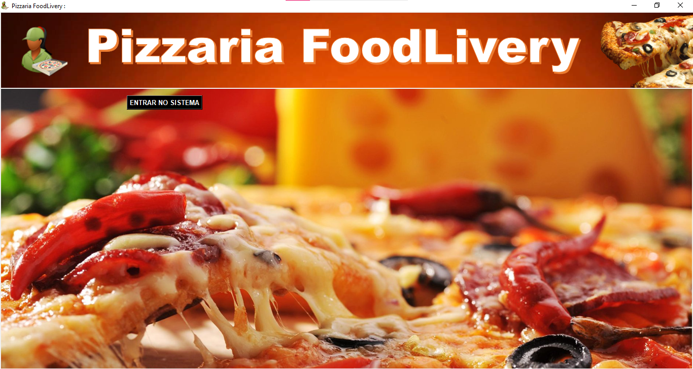
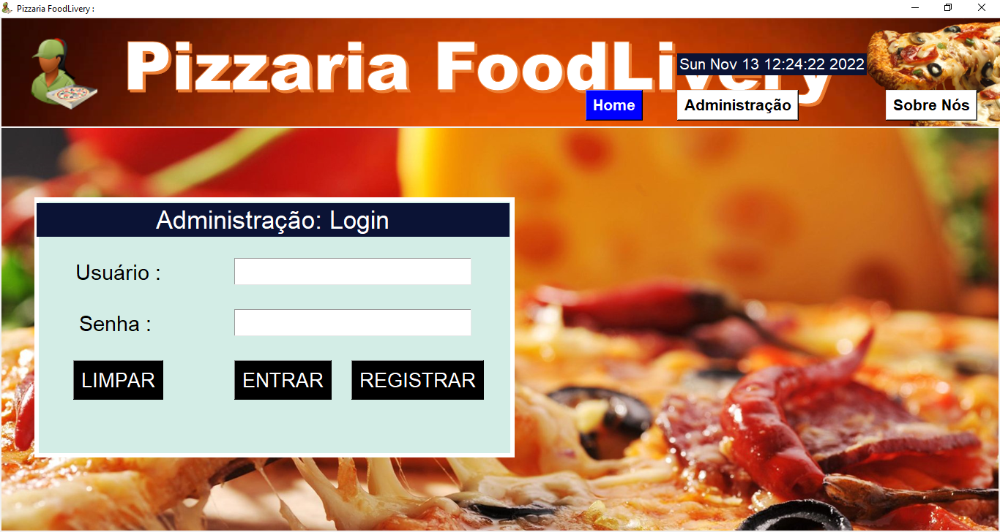
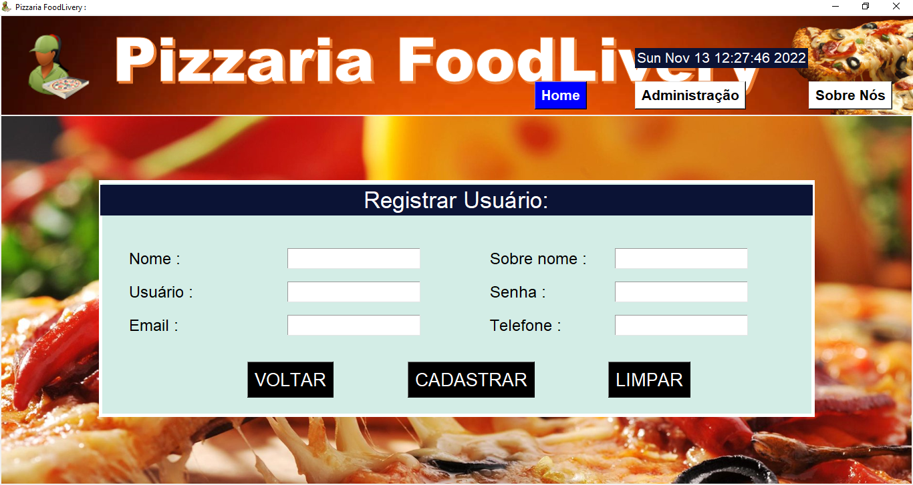
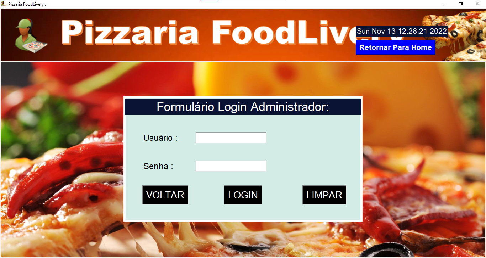

# Sistema de Pizzarria FoodLivery
O Objetivo é criar um sistema de pedido de pizza com área administrativa.

# Front
 

# Login Users
 

# Cadastrar Usuários
 

# Login Admin
 

# App presentation in Python. 
- In update...
  